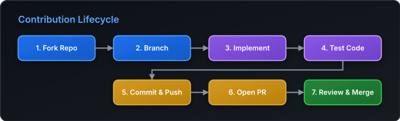

# Contributing Guidelines



Thank you for considering contributing to this repository! Every contribution helps make this project better for everyone.

## How to Contribute

### 1. Reporting Bugs

If you find a bug or issue, please open an issue on GitHub with:
- A clear, descriptive title.
- Steps to reproduce the problem.
- Expected vs. actual behavior.

### 2. Suggesting Enhancements

Suggestions for new features or improvements are welcome! Please open an issue outlining:
- The goal or use case for the enhancement.
- Details on how it should work or look.

### 3. Pull Requests

1. **Fork** the repository and create your branch from `main`:
   ```bash
   git checkout -b feature/your-feature-name
   ```
2. **Make your changes** cleanly and test them.
3. **Commit** your changes with clear, descriptive commit messages:
   ```bash
   git commit -m "feat: add awesome feature"
   ```
4. **Push** to your fork and submit a Pull Request.

## Coding Standards

- Keep code clean and easy to read.
- Follow consistent formatting for code and documentation.
- Test your changes before opening a PR.

## Code of Conduct

Please note that this project is released with a [Contributor Code of Conduct](CODE_OF_CONDUCT.md). By participating in this project you agree to abide by its terms.
