<h3><code>tyrone@github ~ $ whoami</code></h3>

<table>
  <tr>
    <td valign="top"></td>
    <td valign="top"></td>
  </tr>
</table>

  

<h3><code>tyrone@github ~ $ ./snake.sh</code></h3>

---

### 🧰 Languages and Tools

 

