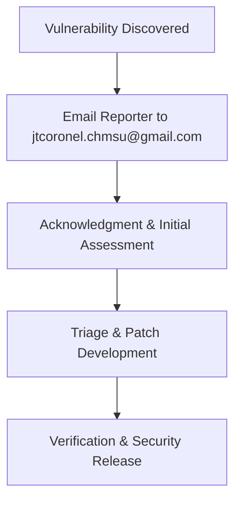

# Security Policy

## Supported Versions

| Version | Supported          |
| ------- | ------------------ |
| Main    | :white_check_mark: |

## Reporting a Vulnerability

If you discover a security vulnerability within this repository, please send an email to **jtcoronel.chmsu@gmail.com**.

All security vulnerabilities will be promptly addressed. Please provide:
- A description of the vulnerability.
- Steps to reproduce the issue.
- Any potential impact or mitigations.

Thank you for helping keep this project secure!
